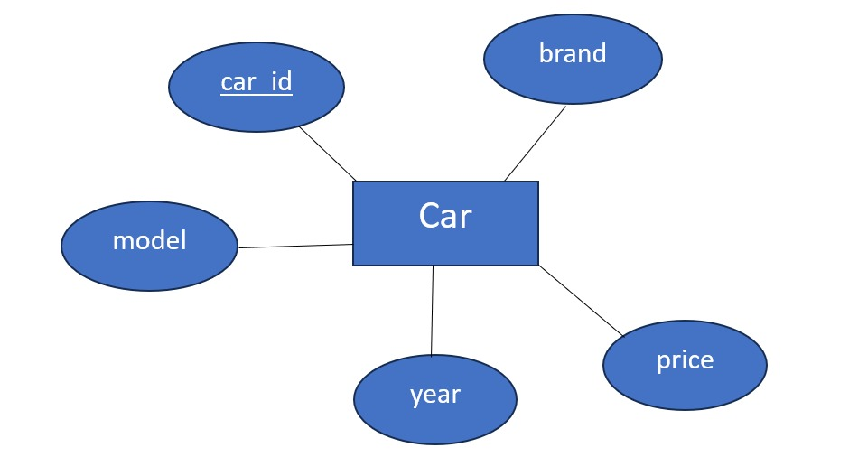
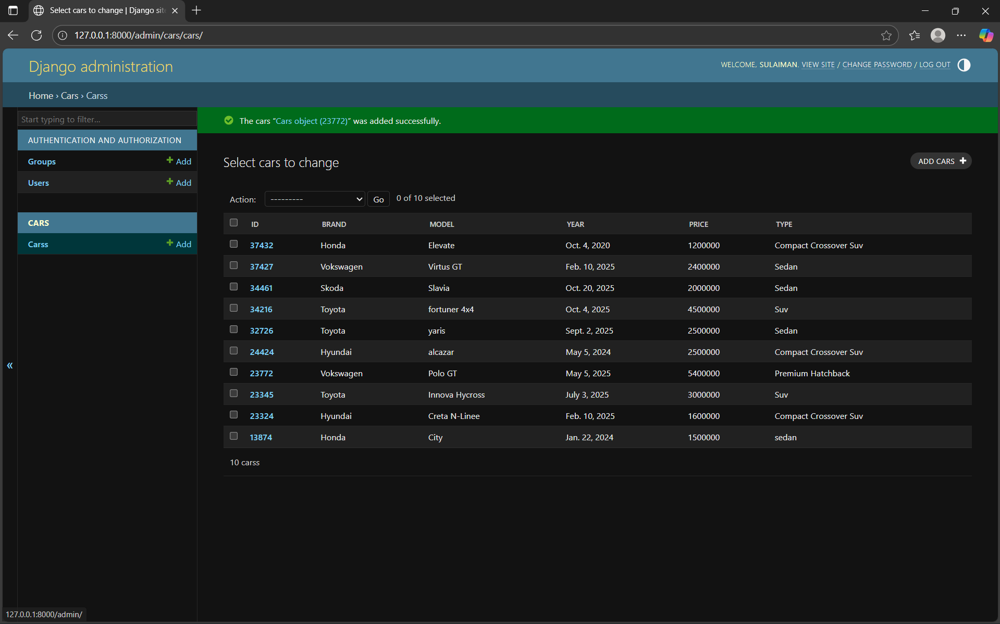

# Ex02 Django ORM Web Application
## Date: 19-09-2025

## AIM
To develop a Django application to store and retrieve data from Movies Database using Object Relational Mapping(ORM).

## ENTITY RELATIONSHIP DIAGRAM



## DESIGN STEPS

### STEP 1:
Clone the problem from GitHub

### STEP 2:
Create a new app in Django project

### STEP 3:
Enter the code for admin.py and models.py

### STEP 4:
Execute Django admin and create details for 10 books

## PROGRAM
```
from django.db import models
from django.contrib import admin

# Create your models here.
class Cars (models.Model):
    id = models.IntegerField(primary_key=True)
    brand = models.CharField(max_length=30)
    model = models.CharField(max_length=50)
    year = models.DateField()
    price = models.IntegerField()
    type = models.CharField(max_length=50)

class Car (admin.ModelAdmin):
    list_display = ('id','brand','model','year','price','type')


from django.contrib import admin
from .models import Cars, Car


# Register your models here.
admin.site.register(Cars,Car)

```

## OUTPUT




## RESULT
Thus the program for creating a database using ORM hass been executed successfully
